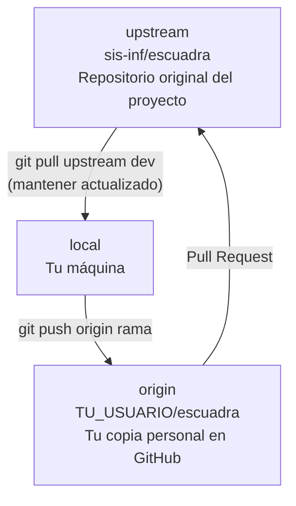
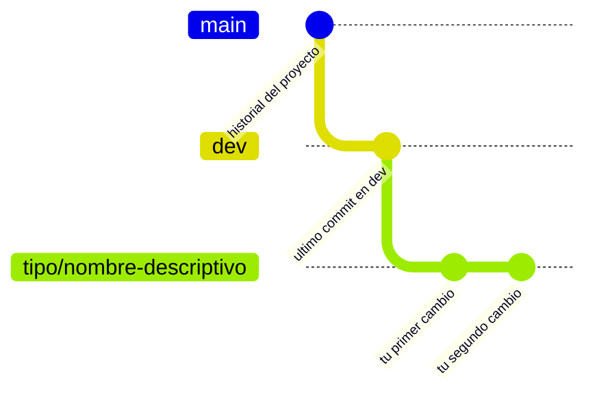
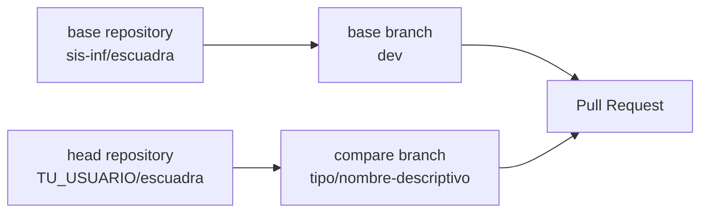
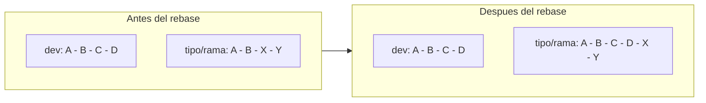

# Guía de primeros pasos para tu primer Pull Request

¡Bienvenido/a a Escuadra!

Si es tu primera vez contribuyendo a un proyecto en GitHub, esta guía te acompañará paso a paso para realizar tu primer Pull Request (PR). Aprenderás cómo preparar tu entorno, crear una rama de trabajo, realizar cambios y enviar tu contribución correctamente.

Cada sección incluye los comandos necesarios y una explicación sencilla de lo que está ocurriendo, para que puedas seguir el proceso incluso si nunca has utilizado Git o GitHub antes.

---

## ¿Cómo se relacionan los repositorios?

Antes de ejecutar cualquier comando, es importante entender la estructura de tres niveles que usa este proyecto:



- **upstream** es el repositorio oficial del proyecto. No puedes escribir directamente en él.
- **origin** es tu fork (copia) en GitHub. Es tuyo y puedes hacer push libremente.
- **local** es el código en tu máquina. Aquí trabajas.

---

## Paso 1 — Hacer fork del repositorio

Un fork crea una copia del repositorio bajo tu cuenta de GitHub. Es necesario porque no tienes permisos de escritura en el repositorio original.

**Cómo hacerlo:**
1. Ingresa a la página del repositorio de Escuadra en GitHub.
2. Haz clic en el botón **Fork** (esquina superior derecha).
3. Selecciona tu cuenta personal como destino y confirma.

Al terminar, tendrás el repositorio disponible en `https://github.com/TU_USUARIO/escuadra`.

> Este paso se hace una sola vez. Si ya tienes un fork, ve directo al Paso 2.

---

## Paso 2 — Clonar el fork

Clonar descarga el repositorio a tu máquina y configura automáticamente el remote `origin` apuntando a tu fork.

```bash
git clone https://github.com/TU_USUARIO/escuadra.git
cd escuadra
```

**¿Por qué clonar el fork y no el repositorio original?**
Porque si clonas el original, no tendrás permisos para hacer push. Al clonar tu fork, puedes subir cambios libremente y luego proponer esos cambios al proyecto original mediante un PR.

---

## Paso 3 — Configurar el remote upstream

Por defecto, al clonar tu fork, Git solo conoce `origin` (tu fork). Necesitas agregar `upstream` para poder sincronizarte con los cambios del repositorio original.

```bash
git remote add upstream https://github.com/sis-inf/escuadra.git
```

Verifica que ambos remotes estén configurados:

```bash
git remote -v
```

Deberías ver:

```
origin    https://github.com/TU_USUARIO/escuadra.git (fetch)
origin    https://github.com/TU_USUARIO/escuadra.git (push)
upstream  https://github.com/sis-inf/escuadra.git (fetch)
upstream  https://github.com/sis-inf/escuadra.git (push)
```

> Si ves solo `origin`, el comando `git remote add upstream` no se ejecutó correctamente. Vuelve a intentarlo.

---

## Paso 4 — Crear la rama correcta

Nunca trabajes directamente en `dev` o `main`. Cada issue se resuelve en su propia rama, creada desde `dev`.

**¿Por qué es importante?**
Si trabajas en `dev` directamente y el proyecto avanza, tendrás conflictos difíciles de resolver. Una rama aislada te permite trabajar sin interferir con otros cambios.

Primero, actualiza tu `dev` local con los últimos cambios del proyecto:

```bash
git checkout dev
git pull upstream dev
```

Luego crea tu rama:

```bash
git checkout -b tipo/nombre-descriptivo
```

Así queda la estructura de ramas:



El formato del nombre de rama es `tipo/descripcion-corta`. Consulta la tabla de tipos en [CONTRIBUTING.md](../CONTRIBUTING.md#convención-de-ramas).

---

## Paso 5 — Instalar el entorno de desarrollo

El entorno virtual aísla las dependencias del proyecto de tu sistema. Esto evita conflictos entre versiones de librerías de distintos proyectos.

Crea el entorno virtual:

```bash
python -m venv .venv
```

Actívalo:

```bash
# Linux / macOS
source .venv/bin/activate

# Windows CMD
.venv\Scripts\activate

# Windows PowerShell
.venv\Scripts\Activate.ps1
```

Sabrás que está activo porque verás el prefijo `(.venv)` en tu terminal:

```
(.venv) usuario@equipo:~/escuadra$
```

Instala las dependencias:

```bash
pip install -e ".[dev]"
```

La opción `-e` instala el proyecto en modo editable, lo que significa que los cambios que hagas en el código se reflejan inmediatamente sin necesidad de reinstalar.

---

## Paso 6 — Hacer los cambios

Edita únicamente los archivos listados en el issue que estás resolviendo. El issue siempre indica en la sección **"Archivos a tocar"** qué se debe modificar y qué no.

Algunas buenas prácticas:
- Guarda frecuentemente y prueba a medida que avanzas.
- Si necesitas tocar un archivo que no está en el issue, consulta antes con el equipo.
- Mantén cada cambio enfocado en una sola cosa.

---

## Paso 7 — Ejecutar los tests localmente

Antes de hacer commit, verifica que los tests existentes sigan pasando y que tu cambio no rompió nada.

```bash
pytest
```

Para ver el detalle de cada test:

```bash
pytest -v
```

Para ejecutar solo los tests de un archivo específico:

```bash
pytest tests/ruta/al/archivo_test.py -v
```

**No hagas push si hay tests fallando**, salvo que el issue indique explícitamente que los tests serán agregados en otro PR.

---

## Paso 8 — Hacer commit con Conventional Commits

El proyecto usa el estándar Conventional Commits. El formato es:

```
tipo: descripción corta en presente - Closes #N
```

Agrega los archivos que modificaste:

```bash
git add archivo_modificado
```
Ejemplo:
```
git add docs/guia-contribuidor-primeros-pasos.md
```
O todos los cambios:

```bash
git add .
```

Haz el commit (ejemplo):

```bash
git commit -m "docs: agregar guia de primeros pasos - Closes #42"
```

**¿Por qué es importante el formato?**
El historial de commits es la documentación viva del proyecto. Un commit bien escrito le dice a cualquier persona qué cambió y por qué, sin necesidad de leer el código.

Consulta la tabla completa de tipos en [CONTRIBUTING.md](../CONTRIBUTING.md#convención-de-commits).

---

## Paso 9 — Hacer push al fork

Sube tu rama a tu fork en GitHub:

```bash
git push origin tipo/nombre-descriptivo
```

Si es la primera vez que haces push de esa rama:

```bash
git push --set-upstream origin tipo/nombre-descriptivo
```

Después de este paso, tu rama existe tanto en tu máquina como en tu fork de GitHub. El repositorio original todavía no tiene esos cambios — eso sucede en el Paso 10.

---

## Paso 10 — Abrir el Pull Request

1. Ve a `https://github.com/TU_USUARIO/escuadra`.
2. GitHub mostrará un banner **"Compare & pull request"** — haz clic en él.
3. Verifica la configuración del PR:



4. Completa la plantilla del PR: describe qué hace el PR, indica el issue con `Closes #N`, marca el tipo de cambio y completa el checklist.
5. Haz clic en **"Create pull request"**.

> El PR debe abrirse siempre contra `dev`, nunca contra `main`.

---

## ¿Qué hacer si algo sale mal?

### Me equivoqué en el mensaje del último commit

```bash
git commit --amend -m "tipo: mensaje corregido - Closes #N"
```

> Solo funciona si aún **no** hiciste push. Si ya hiciste push, ver la sección "Hice push pero necesito corregir algo".

---

### Hice cambios en `dev` en lugar de en mi rama

```bash
# Guarda tus cambios temporalmente
git stash

# Crea la rama correcta
git checkout -b tipo/nombre-descriptivo

# Recupera tus cambios
git stash pop
```

---

### Mi rama está desactualizada respecto a dev

Esto ocurre cuando `dev` avanzó después de que creaste tu rama.



```bash
git checkout dev
git pull upstream dev
git checkout tipo/nombre-descriptivo
git rebase dev
```

---

### Tengo conflictos al hacer rebase

Git marcará los archivos en conflicto. Ábrelos y busca las marcas:

```
<<<<<<< HEAD
código de dev
=======
tu código
>>>>>>> tipo/nombre-descriptivo
```

Edita el archivo dejando solo el código correcto (puede ser uno, el otro, o una combinación). Luego:

```bash
git add archivo_con_conflicto
git rebase --continue
```

Para cancelar el rebase y volver al estado anterior:

```bash
git rebase --abort
```

---

### Hice push pero necesito corregir algo

```bash
git add archivo
git commit --amend --no-edit
git push --force-with-lease origin tipo/nombre-descriptivo
```

> Usa `--force-with-lease` en lugar de `--force`. Es más seguro porque falla si alguien más subió cambios a esa rama.

---

### No recuerdo en qué rama estoy

```bash
git branch        # lista todas las ramas, marca la actual con *
git status        # muestra rama actual y estado de archivos
```

---

### Quiero deshacer todos mis cambios locales

```bash
# Descarta cambios en archivos ya trackeados
git checkout -- .

# También elimina archivos nuevos sin trackear
git clean -fd
```

> Estos comandos son destructivos. Los cambios eliminados no se pueden recuperar.

---

## Recursos adicionales

- [CONTRIBUTING.md del proyecto](../CONTRIBUTING.md) — referencia rápida oficial
- [Documentación oficial de Git](https://git-scm.com/doc)
- [Conventional Commits en español](https://www.conventionalcommits.org/es/)
- [Guía de GitHub sobre Pull Requests](https://docs.github.com/es/pull-requests)
- [Guía de GitHub sobre forks](https://docs.github.com/es/pull-requests/collaborating-with-pull-requests/working-with-forks)

---

> ¿Algo no quedó claro o encontraste un error en esta guía? Abre un issue con el label `docs` y ayúdanos a mejorarla.
